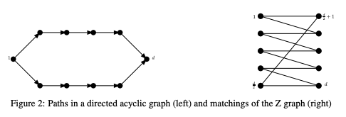
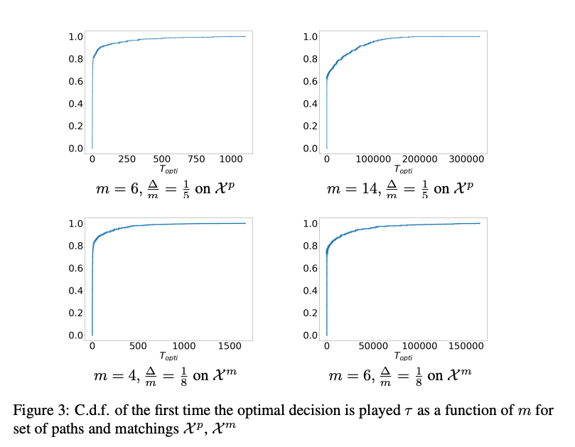
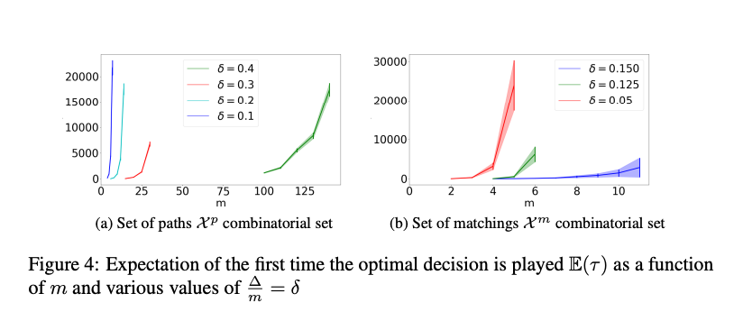
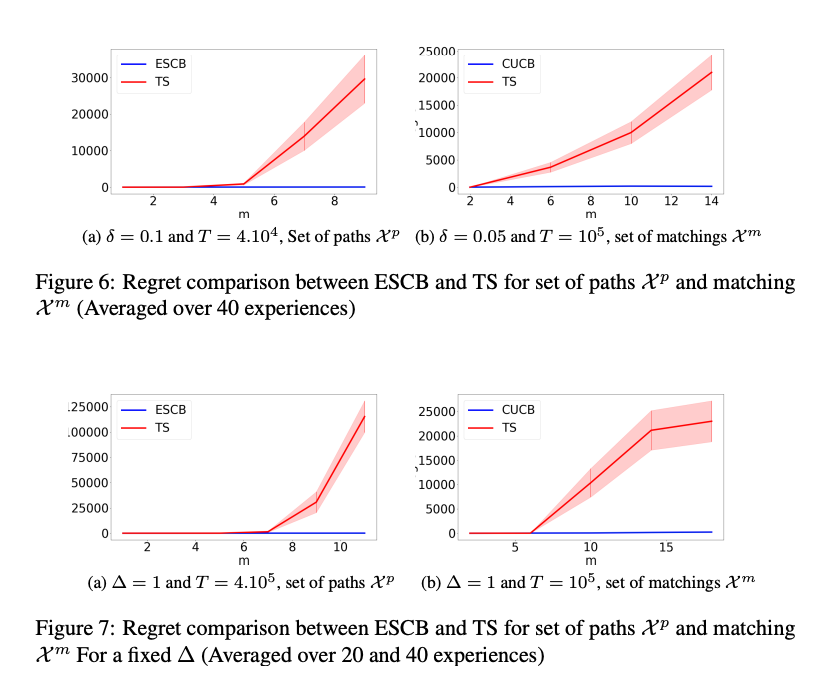

# [On the Suboptimality of Thompson Sampling in High Dimensions](https://arxiv.org/abs/2102.05502) 
## Abstract
In this paper we consider Thompson Sampling (TS) for combinatorial semi-bandits. We demonstrate that, perhaps surprisingly, TS is sub-optimal for this problem in the sense that its regret scales exponentially in the ambient dimension, and its minimax regret scales almost linearly. This phenomenon occurs under a wide variety of assumptions including both non-linear and linear reward functions, with Bernoulli distributed rewards and uniform priors. We also show that including a fixed amount of forced exploration to TS does not alleviate the problem. We complement our theoretical results with numerical results and show that in practice TS indeed can perform very poorly in some high dimensional situations.

## Simple pathological sets considered 

## Numerical results

